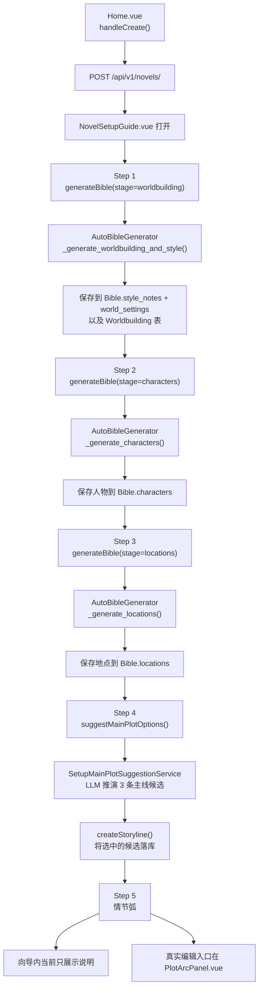

# 新书创建向导代码导读

本文说明 PlotPilot 在“创建小说”之后，向导中以下几个步骤是如何工作的：

- 世界观 + 文风
- 人物
- 地图
- 主线候选
- 情节弧

重点回答两个问题：

1. 每一步是从前端哪里触发的？
2. 最终落到了哪些后端接口、服务和存储逻辑？

## 总览

| 步骤 | 前端入口 | 后端接口 | 核心服务 | 当前状态 |
| --- | --- | --- | --- | --- |
| 创建小说 | `frontend/src/views/Home.vue` `handleCreate()` | `POST /api/v1/novels/` | `NovelService.create_novel()` | 已实现 |
| 世界观 + 文风 | `NovelSetupGuide.vue` `startBibleGeneration()` | `POST /api/v1/bible/novels/{novel_id}/generate?stage=worldbuilding` | `AutoBibleGenerator.generate_and_save(stage="worldbuilding")` | 已实现 |
| 人物 | `NovelSetupGuide.vue` `handleNext()`（Step 1 -> 2） | `POST /api/v1/bible/novels/{novel_id}/generate?stage=characters` | `AutoBibleGenerator.generate_and_save(stage="characters")` | 已实现 |
| 地图 | `NovelSetupGuide.vue` `handleNext()`（Step 2 -> 3） | `POST /api/v1/bible/novels/{novel_id}/generate?stage=locations` | `AutoBibleGenerator.generate_and_save(stage="locations")` | 已实现 |
| 主线候选 | `NovelSetupGuide.vue` `loadPlotSuggestions()` | `POST /api/v1/novels/{novel_id}/setup/suggest-main-plot-options` | `SetupMainPlotSuggestionService.suggest_options()` | 已实现 |
| 选定主线 | `NovelSetupGuide.vue` `adoptPlotOption()` / `adoptCustomMainPlot()` | `POST /api/v1/novels/{novel_id}/storylines` | `StorylineManager` / `StorylineRepository` | 已实现 |
| 情节弧（向导 Step 5） | `NovelSetupGuide.vue` Step 5 | 无 | 无 | 当前仅 UI 说明，未在向导中接线 |
| 情节弧（真实编辑入口） | `frontend/src/components/workbench/PlotArcPanel.vue` | `GET/POST /api/v1/novels/{novel_id}/plot-arc` | `PlotArcRepository` | 已实现（工作台中） |

## 整体流程图



## 0. 创建小说

### 前端入口

文件：`frontend/src/views/Home.vue`

- 用户点击“建档并进入工作台”时，执行 `handleCreate()`
- 该函数会校验 `premise` 非空
- 书名为空时，用梗概前 20 个字符兜底
- `target_chapters` 默认是 `100`

关键代码：

- `newBook` 默认值：`frontend/src/views/Home.vue`
- 创建动作：`frontend/src/views/Home.vue` `handleCreate()`

### 后端接口

文件：`interfaces/api/v1/core/novels.py`

- 路由：`POST /api/v1/novels/`
- 请求模型：`CreateNovelRequest`
- 当前只做“创建小说实体”，不会自动生成 Bible

关键点：

- 路由注释已经明确写了：创建成功后，前端要继续调用 Bible 生成接口

## 1. 世界观 + 文风

### 前端触发

文件：`frontend/src/components/onboarding/NovelSetupGuide.vue`

- 向导打开时，`watch(() => props.show, ...)` 会调用 `startBibleGeneration()`
- `startBibleGeneration()` 会请求：

```ts
bibleApi.generateBible(props.novelId, 'worldbuilding')
```

- 然后轮询：

```ts
bibleApi.getBibleStatus(props.novelId)
```

- 如果状态就绪，再加载：
  - `bibleApi.getBible(props.novelId)`
  - `worldbuildingApi.getWorldbuilding(props.novelId)`

### 后端接口

文件：`interfaces/api/v1/world/bible.py`

- 路由：`POST /api/v1/bible/novels/{novel_id}/generate?stage=worldbuilding`
- 实际逻辑在后台任务 `_generate_task()`

这条后台任务会：

1. 读取小说信息（`premise`、`title`、`target_chapters`）
2. 调用 `bible_generator.generate_and_save(..., stage="worldbuilding")`
3. 根据返回结果拼 `bible_summary`
4. 额外调用 `knowledge_generator.generate_and_save(...)`

注意：

- 当前代码里即使只跑 `worldbuilding` 阶段，后台任务结束后仍会顺带跑一遍 Knowledge 生成

### 核心服务

文件：`application/world/services/auto_bible_generator.py`

入口：

- `generate_and_save(..., stage="worldbuilding")`

核心调用链：

1. `_generate_worldbuilding_and_style(premise, target_chapters)`
2. `_call_llm_and_parse(system_prompt, user_prompt)`
3. `self.llm_service.generate(prompt, config)`

#### Prompt 在哪里

世界观与文风的 Prompt 模板写在：

- `application/world/services/auto_bible_generator.py` `_generate_worldbuilding_and_style()`

这个函数要求 LLM 输出：

```json
{
  "style": "...",
  "worldbuilding": {
    "core_rules": { ... },
    "geography": { ... },
    "society": { ... },
    "culture": { ... },
    "daily_life": { ... }
  }
}
```

#### 结果如何落库

同文件中的 `generate_and_save(stage="worldbuilding")` 会：

- 把 `style` 保存为 `Bible.style_notes`
- 调用 `_save_worldbuilding(...)`

而 `_save_worldbuilding(...)` 会同时写两份：

1. `Worldbuilding` 表  
   文件：`application/world/services/worldbuilding_service.py`
2. `Bible.world_settings`  
   用扁平键名如 `core_rules.power_system`

### 前端如何显示

文件：`frontend/src/components/onboarding/NovelSetupGuide.vue`

前端会优先读 `worldbuildingApi.getWorldbuilding()` 的五维结构，
如果失败，再用 `Bible.world_settings` 反推五维结构并 merge。

这就是为什么世界观有“双存储”：

- `Worldbuilding` 表：给后续 AI 继续生成角色、地图时读取
- `Bible.world_settings`：给现有 Bible 面板和前端展示复用

## 2. 人物

### 前端触发

文件：`frontend/src/components/onboarding/NovelSetupGuide.vue`

- 当 Step 1 点“确认并继续”时，`handleNext()` 进入 Step 2
- 然后调用：

```ts
bibleApi.generateBible(props.novelId, 'characters')
```

- 接着循环调用 `bibleApi.getBible(props.novelId)`，直到 `bible.characters.length > 0`

### 后端接口

仍然是：

- `POST /api/v1/bible/novels/{novel_id}/generate?stage=characters`

后台任务仍在：

- `interfaces/api/v1/world/bible.py` `_generate_task()`

### 核心服务

文件：`application/world/services/auto_bible_generator.py`

入口：

- `generate_and_save(..., stage="characters")`

调用链：

1. `_load_worldbuilding(novel_id)`  
   从 `Worldbuilding` 表读取世界观
2. `_generate_characters(premise, target_chapters, existing_worldbuilding)`  
   构造人物 Prompt
3. `_call_llm_and_parse(...)`
4. 保存人物到 `Bible.characters`

#### Prompt 在哪里

- `application/world/services/auto_bible_generator.py` `_generate_characters()`

该 Prompt 要求输出：

```json
{
  "characters": [
    {
      "name": "...",
      "role": "...",
      "description": "...",
      "relationships": [...]
    }
  ]
}
```

#### 结果如何落库

在 `generate_and_save(stage="characters")` 中：

- 遍历 `bible_data["characters"]`
- 通过 `BibleService.add_character(...)` 写入 Bible
- 如果配置了 `triple_repository`，还会基于人物关系生成三元组

## 3. 地图

### 前端触发

文件：`frontend/src/components/onboarding/NovelSetupGuide.vue`

- 当 Step 2 点“确认并继续”时，`handleNext()` 进入 Step 3
- 然后调用：

```ts
bibleApi.generateBible(props.novelId, 'locations')
```

- 接着轮询 `bibleApi.getBible(props.novelId)`，直到 `bible.locations.length > 0`

### 后端接口

仍然是：

- `POST /api/v1/bible/novels/{novel_id}/generate?stage=locations`

### 核心服务

文件：`application/world/services/auto_bible_generator.py`

入口：

- `generate_and_save(..., stage="locations")`

调用链：

1. `_load_worldbuilding(novel_id)`
2. `_load_characters(novel_id)`
3. `_generate_locations(premise, target_chapters, existing_worldbuilding, existing_characters)`
4. 保存地点到 `Bible.locations`

#### Prompt 在哪里

- `application/world/services/auto_bible_generator.py` `_generate_locations()`

该 Prompt 要求输出：

```json
{
  "locations": [
    {
      "id": "...",
      "name": "...",
      "type": "...",
      "description": "...",
      "parent_id": null,
      "connections": [...]
    }
  ]
}
```

#### 结果如何落库

在 `generate_and_save(stage="locations")` 中：

- 遍历 `bible_data["locations"]`
- 通过 `BibleService.add_location(...)` 写入 Bible
- 如果配置了 `triple_repository`，会调用 `_generate_location_triples(...)`

### 当前实现备注

地图这一步比人物更依赖 LLM 返回结构稳定，因为：

- `name`
- `description`
- `type`
- `parent_id`
- `connections`

这些字段都是后续保存和构图的输入

## 4. 主线候选

### 前端触发

文件：`frontend/src/components/onboarding/NovelSetupGuide.vue`

- 当 `currentStep === 4` 时，`watch(currentStep, ...)` 会触发 `loadPlotSuggestions()`
- 它调用：

```ts
workflowApi.suggestMainPlotOptions(props.novelId)
```

### 后端接口

文件：`interfaces/api/v1/engine/generation.py`

- 路由：`POST /api/v1/novels/{novel_id}/setup/suggest-main-plot-options`

### 核心服务

文件：`application/blueprint/services/setup_main_plot_suggestion_service.py`

入口：

- `SetupMainPlotSuggestionService.suggest_options(novel_id)`

调用链：

1. `_build_context(novel_id)`  
   聚合：
   - 小说标题
   - 小说梗概
   - 目标章节数
   - 主角
   - 其他人物
   - 地点
   - 世界观摘要
   - 文风提示
2. 构建 prompt，要求固定输出 3 条候选
3. `_llm.generate(prompt, config)`
4. `_parse_plot_json(...)`
5. `_normalize_options(...)`
6. 如果解析失败或数量不足，则 `_fallback_options(...)`

### 候选如何落库

用户选择候选时，前端不会直接存“候选对象”，而是把选中的结果转成一条正式故事线：

- `adoptPlotOption(opt)`
- `adoptCustomMainPlot()`

它们都会调用：

```ts
workflowApi.createStoryline(props.novelId, {
  storyline_type: 'main_plot',
  estimated_chapter_start: 1,
  estimated_chapter_end: chapterEndForStoryline.value,
  name: ...,
  description: ...,
})
```

对应后端是：

- `POST /api/v1/novels/{novel_id}/storylines`
- 路由文件：`interfaces/api/v1/engine/generation.py`

也就是说：

- “主线候选” 是 LLM 临时推演结果
- “选中主线” 才真正写进 Storyline 系统

## 5. 情节弧

### 向导中的当前状态

文件：`frontend/src/components/onboarding/NovelSetupGuide.vue`

向导 Step 5 目前只是静态说明文案：

- 页面上展示“开端 / 上升 / 转折 / 高潮 / 结局”
- `handleNext()` 在 Step 5 只是简单 `currentStep++`
- 没有任何 API 调用
- 没有任何 PlotArc 落库

因此，**向导里的 Step 5 当前不是“生成情节弧”，而是一个占位说明步骤。**

### 真正的情节弧代码在哪里

前端真实编辑入口：

- `frontend/src/components/workbench/PlotArcPanel.vue`

前端 API：

- `frontend/src/api/workflow.ts`
  - `getPlotArc(novelId)`
  - `createPlotArc(novelId, data)`

后端路由：

- `interfaces/api/v1/engine/generation.py`
  - `GET /api/v1/novels/{novel_id}/plot-arc`
  - `POST /api/v1/novels/{novel_id}/plot-arc`

存储：

- `PlotArcRepository`
- `SqlitePlotArcRepository`

### 另外一条“自动情节弧”路径

文件：`application/world/services/chapter_narrative_sync.py`

这里有 `_auto_generate_plot_point(...)`：

- 根据章节张力分数变化
- 自动判断是否生成剧情点
- 自动写入 PlotArc

也就是说，情节弧目前存在两条路径：

1. 手工维护  
   工作台 `PlotArcPanel.vue`
2. 自动补点  
   `chapter_narrative_sync.py` 根据张力变化自动写入

但**这两条都不在“新书创建向导 Step 5”里触发。**

## 关键文件索引

### 前端

- `frontend/src/views/Home.vue`  
  新建小说入口
- `frontend/src/components/onboarding/NovelSetupGuide.vue`  
  向导的 1-6 步主流程
- `frontend/src/api/bible.ts`  
  Bible 生成、状态查询、Bible 读取
- `frontend/src/api/worldbuilding.ts`  
  世界观独立读取/更新
- `frontend/src/api/workflow.ts`  
  主线候选、故事线、情节弧 API
- `frontend/src/components/workbench/PlotArcPanel.vue`  
  情节弧真实编辑入口

### 后端

- `interfaces/api/v1/core/novels.py`  
  创建小说
- `interfaces/api/v1/world/bible.py`  
  分阶段触发 Bible / Knowledge 生成
- `interfaces/api/v1/world/worldbuilding_routes.py`  
  世界观独立接口
- `interfaces/api/v1/engine/generation.py`  
  主线候选、Storyline、PlotArc 路由

### 服务层

- `application/world/services/auto_bible_generator.py`  
  世界观、文风、人物、地图 Prompt 与保存逻辑
- `application/world/services/worldbuilding_service.py`  
  世界观表读写
- `application/blueprint/services/setup_main_plot_suggestion_service.py`  
  主线候选推演
- `application/world/services/chapter_narrative_sync.py`  
  自动补剧情点

## 当前结论

如果只看“创建小说向导”的真实实现状态：

- 世界观 + 文风：已接通
- 人物：已接通
- 地图：已接通
- 主线候选：已接通
- 情节弧：**向导内未接通，仅工作台中可编辑**

如果后续要继续完善向导，最自然的下一步是：

1. 给 Step 5 接上 `workflowApi.getPlotArc/createPlotArc`
2. 或者增加一个“AI 先生成初版情节弧”的接口，再让用户确认

